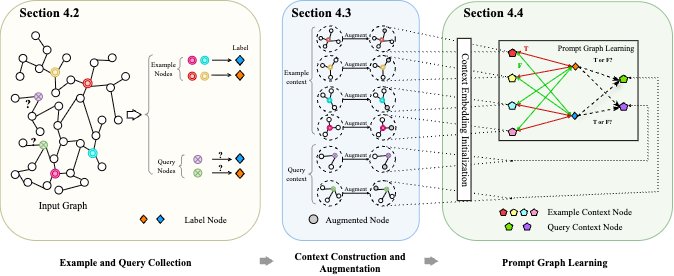

# CTP: A Cross-graph Tuning-free Prompt Framework

This repository contains the **supplementary material** and implementation code for the paper:

**"A Cross-graph Tuning-free Prompt Framework"**




The model architecture and theoretical details are described in the main paper. This codebase provides the experimental implementation for reproducing the results.


### Prerequisites

- Python 3.8+
- CUDA-compatible GPU
- PyTorch with CUDA support

### Setup

Install dependencies:

```bash
pip install -r requirements.txt
```

## Experiments

### Pretrain on MAG240M Dataset

For training and evaluation on the MAG240M dataset:

```bash
python experiments/run_single_experiment.py --dataset mag240m --root <ROOT> --original_features True -ds_cap 1515 -val_cap 100 -test_cap 100 --epochs 1 -ckpt_step 1000 -layers S2,U,M -lr 3e-4 -way 30 -shot 3 -qry 4 -eval_step 200 -task neighbor_matching -bs 1 -aug GP0.5P0.2S52,NZ0.5 -aug_test True -attr 1000 --device 2 --prefix MAG_PT_GITP --centroids_path <centroid_root> --sampling-mode mixed_batch --workers 1 -orth 0.5 -mean_label_emb True
```

### Evaluate on ArXiv Dataset

For evaluation on the ArXiv dataset:

```bash
python experiments/run_single_experiment.py --dataset arxiv --root <ROOT>  -ds_cap 510 -val_cap 510 -test_cap 500 -eval_step 100 -epochs 1 --layers S2,U,M -way 40 -shot 30 -qry 3 -lr 1e-5 -bert roberta-base-nli-stsb-mean-tokens -pretrained <PATH_TO_CHECKPOINT> --eval_only True --train_cap 10 --device 0 -mean_label_emb True
```

### Pretrain on Wiki Dataset

For training on the Wiki dataset:

```bash
python3 experiments/run_single_experiment.py --root <DATA_ROOT> --dataset Wiki --emb_dim 256 --device 3 --input_dim 768 --layers S2,UX,M2 -ds_cap 8000 -lr 1e-3 --prefix Wiki_PT_GITP  -esp 500 --eval_step 1000 --epochs 1 --dropout 0 --n_way 15 -bs 10 -qry 4 -shot 3 --task neighbor_matching --ignore_label_embeddings True -val_cap 10 -test_cap 10 -aug  GP0.5P0.1S42,NZ0.5 -aug_test True -ckpt_step 1000 --all_test True -attr 1000 -meta_pos True --centroids_path <CENTROIDS_ROOT>—sampling-mode mixed_batch --workers 1 -orth 0.5 -mean_label_emb True
```

### Evaluate on ConceptNet Dataset

For evaluation on the ConceptNet dataset:

```bash
python3 experiments/run_single_experiment.py --root <DATA_ROOT>  --dataset ConceptNet --emb_dim 256 -shot 3 --device 1 --input_dim 768 --layers S2,UX,M2  -ds_cap 10 --prefix ConceptNet_eval_GITP -esp 500 --eval_step 1000 --epochs 1 --dropout 0 --n_way 4 -bs 1 -qry 4 --ignore_label_embeddings True --task multiway_classification -test_cap 500 -val_cap 10 --workers 15  -meta_pos True   --eval_only True  -pretrained <PATH_TO_CHECKPOINT> --all_test True   --no_split_labels True  --label_set 0 1 2 3 4 5 6 7 8 9 10 11 12 13 -mean_label_emb True
```

### Evaluate on FB15K-237 Dataset

For evaluation on the FB15K-237 dataset:

```bash
python3 experiments/run_single_experiment.py --root <DATA_ROOT>  --dataset FB15K-237 --emb_dim 256 -shot 3 --device 1 --input_dim 768 --layers S2,UX,M2  -ds_cap 10 --prefix FB15K-237_eval_GITP -esp 500 --eval_step 1000 --epochs 1 --dropout 0 --n_way 5 -bs 1 -qry 4 --ignore_label_embeddings True --task multiway_classification -test_cap 500 -val_cap 10 --workers 15  -meta_pos  True   --eval_only True  -pretrained <PATH_TO_CHECKPOINT> --all_test True   --no_split_labels True  --label_set 0 1 2 3 4 5 6 7 8 9 10 11 12 13 14 15 16 17 18 19 20 21 22 23 24 25 26 27 28 29 30 31 32 33 34 35 36 37 38 39 40 41 42 43 44 45 46 47 48 49 50 51 52 53 54 55 56 57 58 59 60 61 62 63 64 65 66 67 68 69 70 71 72 73 74 75 76 77 78 79 80 81 82 83 84 85 86 87 88 89 90 91 92 93 94 95 96 97 98 99 100 101 102 103 104 105 106 107 108 109 110 111 112 113 114 115 116 117 118 119 120 121 122 123 124 125 126 127 128 129 130 131 132 133 134 135 136 137 138 139 140 141 142 143 144 145 146 147 148 149 150 151 152 153 154 155 156 157 158 159 160 161 162 163 164 165 166 167 168 169 170 171 172 173 174 175 176 177 178 179 180 181 182 183 184 185 186 187 188 189 190 191 192 193 194 195 196 197 198 199 -mean_label_emb True
```

### Evaluate on NELL Dataset

For evaluation on the NELL dataset:

```bash
python3 experiments/run_single_experiment.py --root <DATA_ROOT>  --dataset NELL --emb_dim 256 -shot 3 --device 1 --input_dim 768 --layers S2,UX,M2  -ds_cap 10 --prefix InContext_eval_PRODIGY -esp 500 --eval_step 1000 --epochs 1 --dropout 0 --n_way 5 -bs 1 -qry 4 --ignore_label_embeddings True --task multiway_classification -test_cap 500 -val_cap 10 --workers 15  -meta_pos  True   --eval_only True  -pretrained <PATH_TO_CHECKPOINT> --all_test True   --no_split_labels True  --label_set 1 2 3 4 6 9 10 11 13 14 16 18 19 22 25 27 29 31 32 35 38 39 42 45 46 51 55 57 59 60 62 63 66 69 70 71 73 77 78 79 82 84 88 90 91 92 93 94 102 105 106 107 108 109 110 112 115 116 120 121 122 123 126 127 128 129 130 136 143 152 155 157 158 159 160 168 170 171 173 175 176 177 178 181 183 186 187 188 189 190 192 194 195 198 202 204 206 209 212 215 217 219 220 221 225 227 230 231 236 240 253 255 256 257 258 259 261 262 263 264 266 267 273 274 276 277 279 281 282 283 285 286 289 290 -mean_label_emb True
```

## Parameter Placeholders

Before running the experiments, replace the following placeholders with actual paths:

- `<ROOT>` / `<DATA_ROOT>`: Path to your dataset root directory
- `<centroid_root>` / `<CENTROIDS_ROOT>`: Path to precomputed centroid files
- `<PATH_TO_CHECKPOINT>`: Path to pretrained model checkpoints for evaluation

## Dataset Support

All datasets are publicly accessible: MAG240M and ArXiv can be downloaded automatically, while the other four datasets are available from the PRODIGY paper repository.

- **MAG240M**: Large-scale academic paper citation network
- **ArXiv**: Scientific paper classification dataset
- **Wiki**: Wikipedia knowledge graph
- **ConceptNet**: Commonsense knowledge graph
- **FB15K-237**: Freebase knowledge graph subset
- **NELL**: Never-Ending Language Learning knowledge base

## Embeddings & Centroid Generation

Due to size limitations, we are unable to include the generated embeddings or centroid sets. Instead, below is the code we used to produce them.  Both steps only need to be run once; the resulting centroid files are passed to training scripts via `--centroids_path`. 

\- ***\*MAG240M\****: The 20M node subset is created using `data/mag240m_subset.py` (connected subgraph sampling). Embeddings are then produced with `data/train_graphsage.py` (GraphSAGE training). Representative nodes are selected via FAISS-based K-means in `data/select_centroids_mag.py`, producing `mag240m_subset_*_centroid_indices_k*.pt.

\- ***\*Wiki\****: Embeddings are produced with `data/wiki_hinsage.py` . Centroids are selected with K-means in `data/select_centroids_wiki.py`, generating `wiki_article_subset_*_centroid_indices_k*.pt`.


